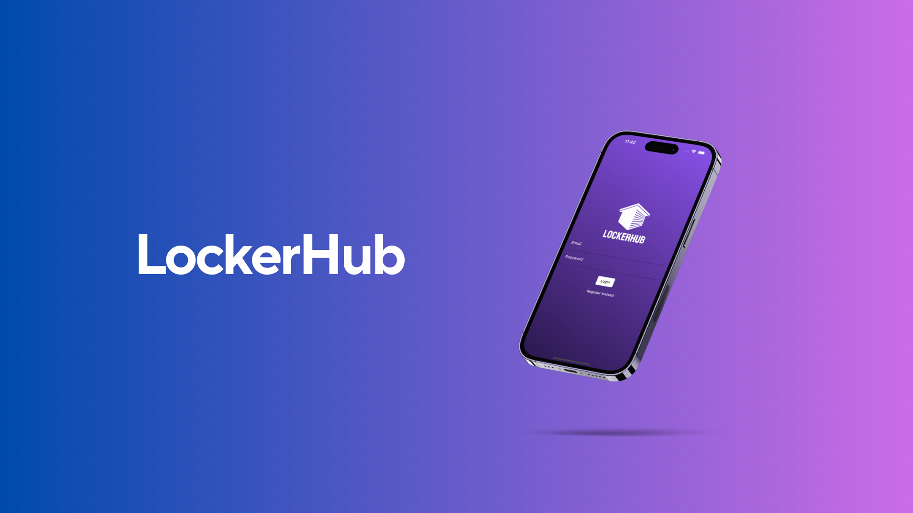
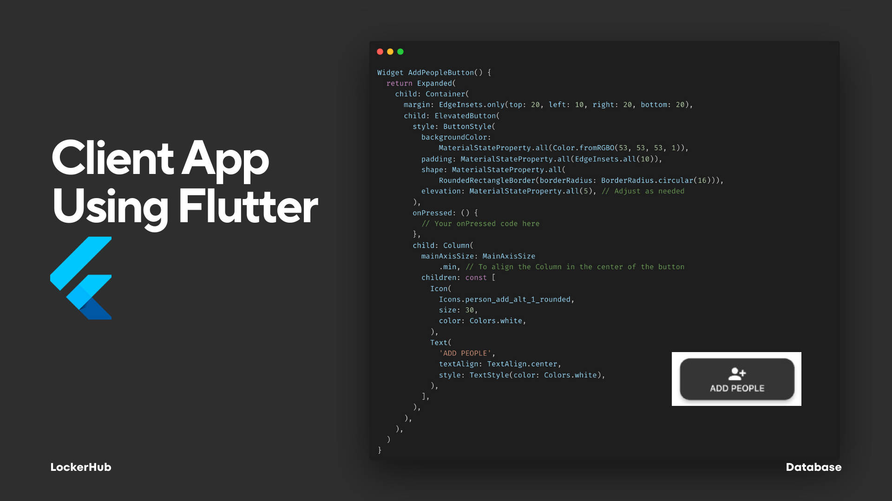
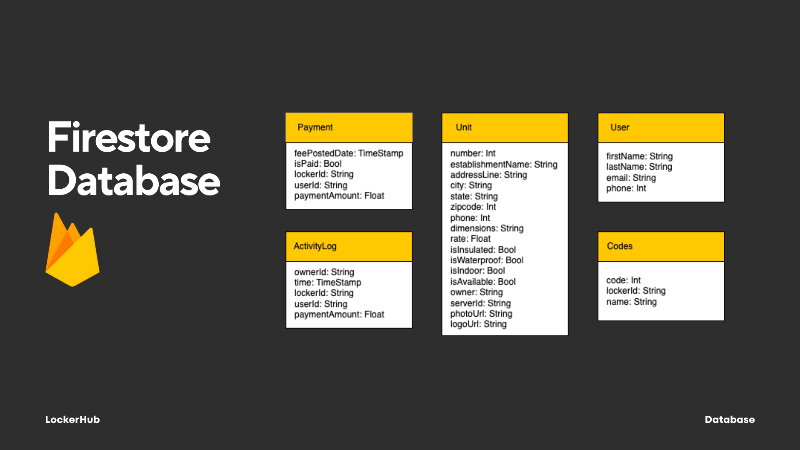
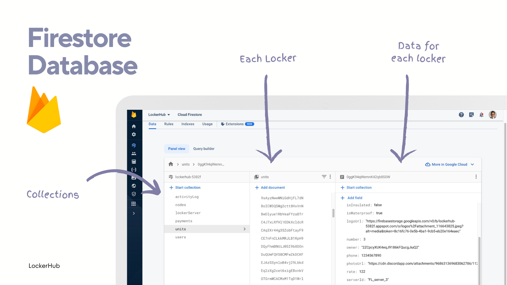
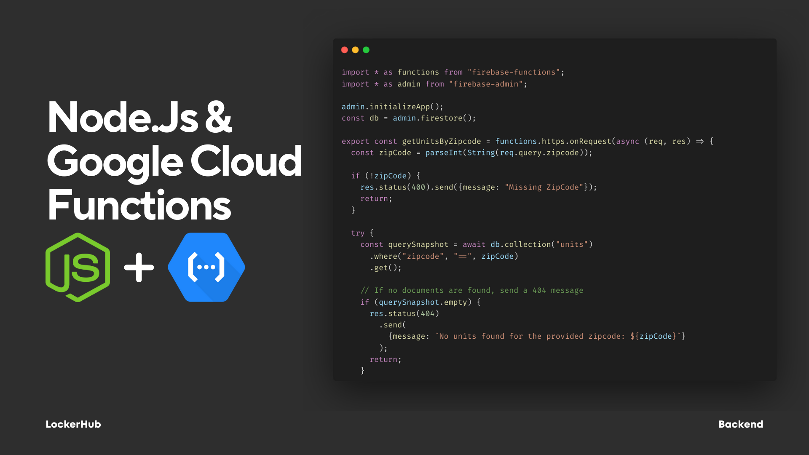
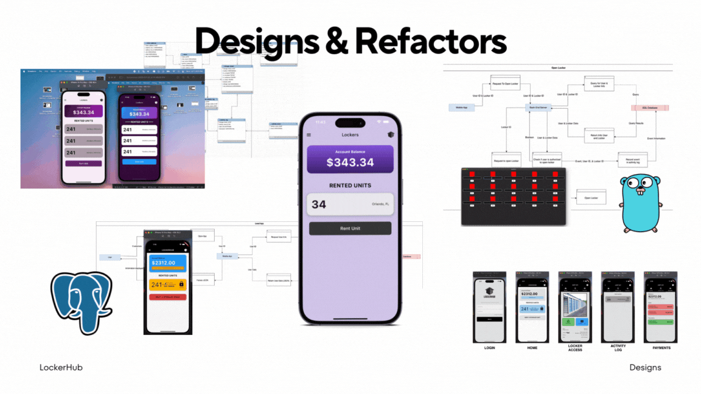
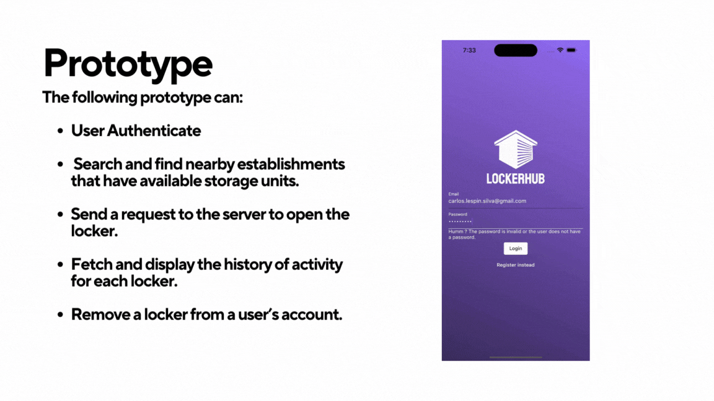
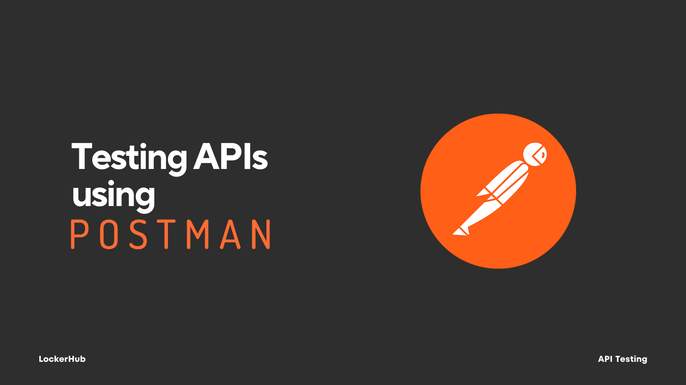
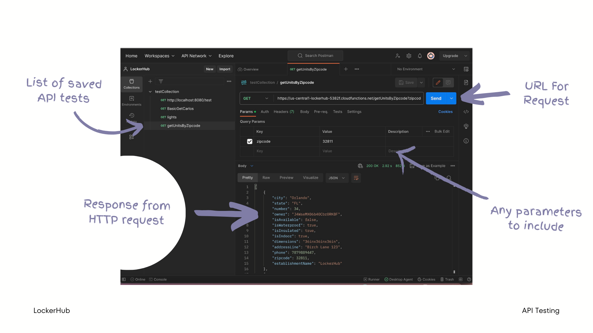

# LockerHub

This prototype was my first attempt at a mobile app during college. It's a full stack project, built using Flutter, Firestore, and Google Cloud Functions.



## Flutter UI Code Example


## Firestore Database Structure





## Backed Server Code



## Development Process


The app went through multiple iterations before reaching the final prototype. Earlier versions used:
* GoLang Server
* PostgresSQL Database
* Different Color Schemes
* Authentication through server and the SQL Database.
* A Python program that included a simulation of a multiple lockers to test how the app would open each one.
* Class & Component Diagrams for the elements within the app.

As I developed the app more, I looked for ways to simplify the project the most I could. I eventually reached the current tech stack that I employed: Flutter, Google Cloud Functions, Firebase Authentication, and Firestore. This new stack provided me with features to leverage and speed up the development process. The app isn't perfect or complete, but building this prototype helped me learn and cover many new concepts and technologies.




## Running the App

The app has only been tested with iOS devices. Clone the repository and run the ```flutter run``` command to build the app on an Iphone or App Simulator on your Mac. Otherwise, download and setup the Android Studio SDK to run the app on an android simulation.

Servers and database for app aren't being currently  hosted. But, the app contains placeholders for content that would normally be fetched from database. Authentication can be turned off by changing one line of code in the "widget_tree.dart" file.


## Deploying Server and Database

To deploy the server and database, you would need to create a developer account with Google's Cloud Services. Then create a project and create firestore database with the structure shown earlier. Fill it up with data.

Inside of this Firebase Project, deploy the code in the "server" folder to Cloud Functions. To deploy, follow the documentation on Google's official website to install the Firebase CLI and deploy the Typescript code.

## Testing Server and Database



After the database and server have been deployed, you can then interface with the flutter app using your own firebase access keys or use Postman to test your API.


