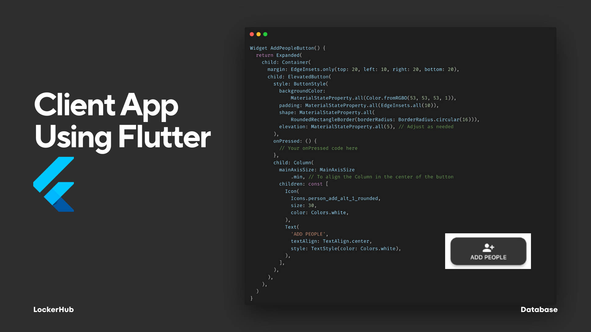
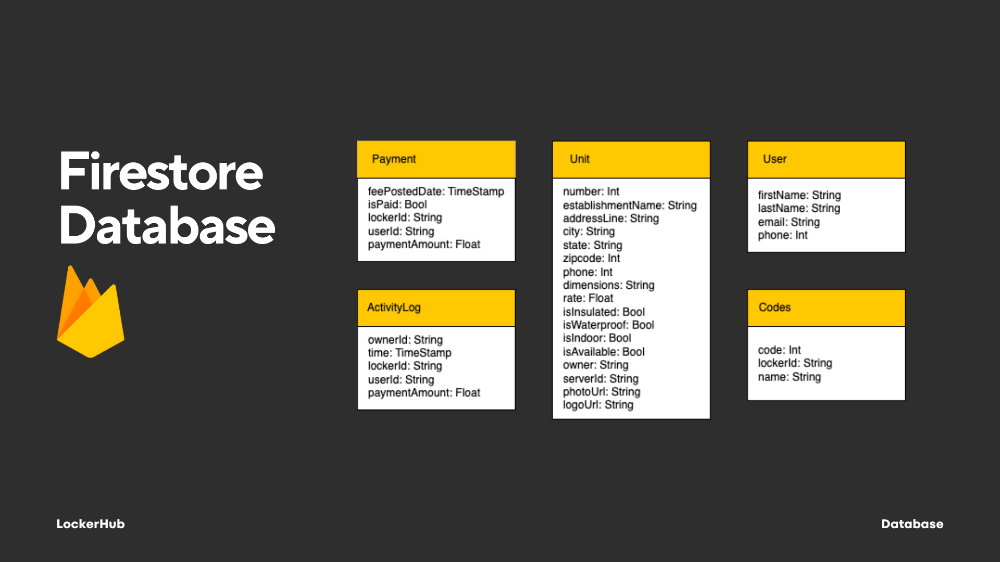
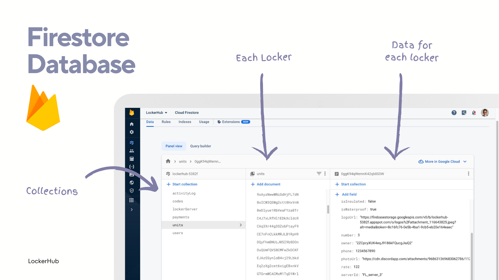
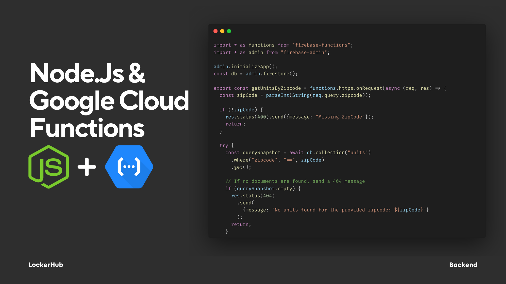

# LockerHub

This prototype was my first attempt at a mobile app during college. It's a full stack project, built using Flutter, Firestore, and Google Cloud Functions.

## Flutter UI Code Example

## Firestore Database Structure

## Backed Server Code
