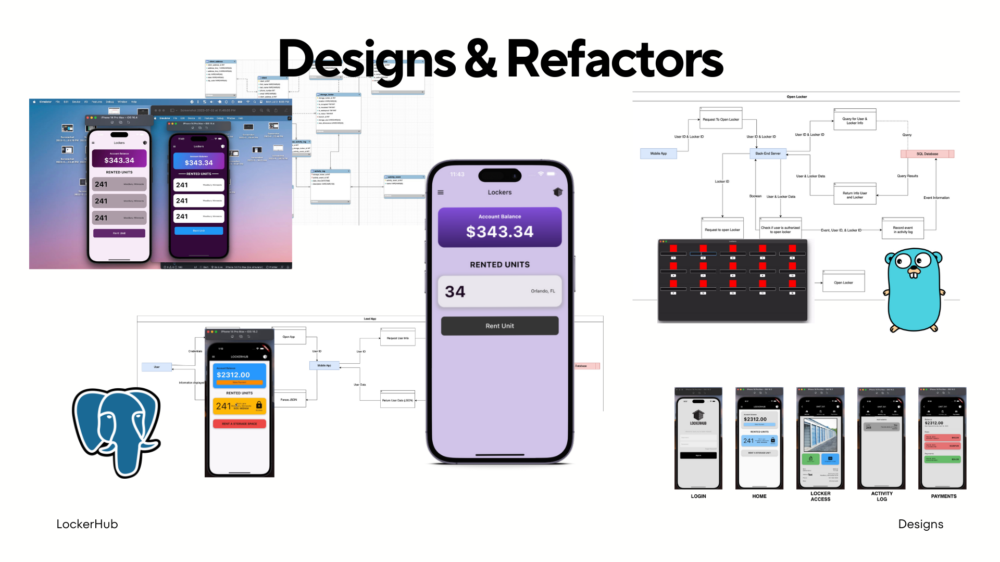

# LockerHub

This prototype was my first attempt at a mobile app during college. It's a full stack project, built using Flutter, Firestore, and Google Cloud Functions.


## Flutter UI Code Example


## Firestore Database Structure


## Backed Server Code


## Development Process


The app went through multiple iterations before reaching the final prototype. Earlier versions used:
* GoLang Server
* PostgresSQL Database
* Different Color Schemes
* Authentication through server and the SQL Database.
* A Python program that included a simulation of a multiple lockers to test how the app would open each one.
* Class & Component Diagrams for the elements within the app.

As I developed the app more, I looked for ways to simplify the project the most I could. I eventually reached the current tech stack that I employed: Flutter, Google Cloud Functions, Firebase Authentication, and Firestore. This new stack provided me with features to leverage and speed up the development process. The app isn't perfect or complete, but building this prototype helped me learn and cover many new concepts and technologies.


## Running the App

The app has only been tested with iOS devices. Clone the repository and run the ```flutter run``` command to build the app on an Iphone or App Simulator on your Mac. Otherwise, download and setup the Android Studio SDK to run the app on an android simulation.